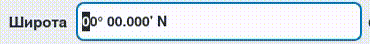
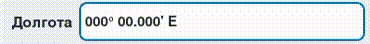
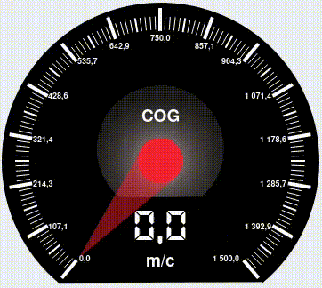

# NavyComponents
qt c++ navigation widget and help functions


# NmeaBuilder 

Allows you to create NMEA messages in the required format
Will return nmea message with calculated checksum and required characters

Autor [pandazz77](https://github.com/pandazz77)

## Using

```c++
     //Example
     //init
     Nmea rmc_nmea("GNRMC",{"000000.00","V","0000.0000","N","00000.0000","E","0.0","0.0","000000","","","N"});
     // time
     rmc_nmea.set(1, ui->sns_time->dateTime().toString("HHmmss.z").toStdString());
     // status
     rmc_nmea.set(2, ui->AUTO_STATUS->isChecked() ? "A" :
               ui->DIFF_STATUS->isChecked() ? "D" :
               ui->INVALID_STATUS->isChecked() ? "V" : "V");
     // lat
     double lat = ui->lat->value();
     QString latDeg = QString("%1").arg(qAbs(static_cast<int>(lat)), 2, 10, QChar('0'));
     QString latMin = QString("%1").arg(qAbs(fmod(lat * 60, 60)), 7, 'f', 4, QChar('0'));
     rmc_nmea.set(3, (latDeg + latMin).toStdString());
     rmc_nmea.set(4, lat >= 0 ? "N" : "S");
     // lon
     double lon = ui->lon->value();
     QString lonDeg = QString("%1").arg(qAbs(static_cast<int>(lon)), 3, 10, QChar('0'));
     QString lonMin = QString("%1").arg(qAbs(fmod(lon * 60, 60)), 7, 'f', 4, QChar('0'));
     rmc_nmea.set(5, (lonDeg + lonMin).toStdString());
     rmc_nmea.set(6, lon >= 0 ? "E" : "W");
     // speed (kn)
     double vel = ui->vel->getValue() * 1.944;
     rmc_nmea.set(7, QString("%1").arg(vel, 3, 'f', 1, QChar('0')).toStdString());
     // cource
     double cog = ui->cog->value();
     rmc_nmea.set(8, QString("%1").arg(cog, 6, 'f', 2, QChar('0')).toStdString());

     // date
     rmc_nmea.set(9, ui->sns_time->dateTime().toString("ddMMyy").toStdString());

     // magn
     double magn = ui->magn->value();
     rmc_nmea.set(10, QString("%1").arg(magn, 3, 'f', 1, QChar('0')).toStdString());
     rmc_nmea.set(11, "E");

     // mode
     rmc_nmea.set(12, ui->AUTO->isChecked() ? "A" :
               ui->DIFF->isChecked() ? "D" :
               ui->WAIT->isChecked() ? "E" :
               ui->MANUAL->isChecked() ? "M" :
               ui->IMITATION->isChecked() ? "S" :
               ui->INVALID_STATUS->isChecked() ? "N" : "N");

     //result get std::string
     //$GNRMC,084556.501,A,0000.0000,N,00000.0000,E,0.0,000.00,170325,0.0,E,A*27
```

# CoordinateEdit
These widgets are designed to display geographic coordinates in the formats set for them

Return and accept values ​​in degrees

## LatitudeEdit


## LongitudeEdit


---

```c++
//connect example
 connect(ui->lat,  QOverload<double>::of(&LongitudeEdit::valueChanged), ...);
```

# CircularValueWidget
Widgets for displaying and editing values

The base class provides the ability to customize all the value parameters.

## SpeedometerWidget
Speedometer widget
Allows you to display values ​​and edit
Supports customization via qss

Double click to enable keyboard editing of the value



This class can be built as a plugin for qt designer